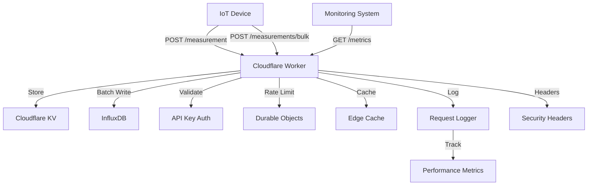

# IoT Backend Service   

A serverless IoT backend service built with Cloudflare Workers. This service provides endpoints for device measurements and system metrics, with built-in API key authentication, rate limiting via Durable Objects, and intelligent caching.

## Table of Contents
- [Features](#features)
- [Architecture](#architecture)
- [Security](#security)
- [API Documentation](#api-documentation)
- [Development](#development)
- [Monitoring](#monitoring)
- [Contributing](#contributing)
- [License](#license)

## Features

- 🔐 **Enhanced Security**
  - API Key Authentication
  - Content Security Policy (CSP)
  - HTTP Security Headers
  - Rate Limiting with Durable Objects
  
- 📊 **Core Functionality**
  - Single and Bulk Device Measurements
  - System Health Metrics
  - Performance Monitoring
  - Version Control
  
- ⚡ **Cloudflare Optimizations**
  - Edge Caching
  - Early Hints
  - HTTP/2 Server Push
  - Bot Management
  
- 📝 **Observability**
  - Comprehensive Request Logging
  - Performance Metrics
  - Request Tracing
  - Error Tracking

## Architecture



## Security

### Headers
- Content Security Policy (CSP)
- X-Content-Type-Options
- X-Frame-Options
- X-XSS-Protection
- Referrer-Policy
- Permissions-Policy

### Authentication
- API key validation
- Rate limiting per key
- Request signing (optional)

### Performance Headers
- Early Hints (103)
- HTTP/2 Server Push
- Cache-Control directives
- Edge caching configuration

## API Documentation

### Base URL
```
https://api.pasts.dev
```

### Authentication
All endpoints (except `/health`, `/time`) require API key authentication:
```bash
curl -H "x-api-key: YOUR_API_KEY" https://api.pasts.dev/endpoint
```

### Rate Limiting
- 100 requests per minute per API key
- Headers: `X-RateLimit-Limit`, `X-RateLimit-Remaining`, `X-RateLimit-Reset`
- Bulk measurements count as single request

### Endpoints

#### POST /measurement
Submit a single device measurement
```bash
curl -X POST https://api.pasts.dev/measurement \
  -H "x-api-key: YOUR_API_KEY" \
  -H "Content-Type: application/json" \
  -d '{
    "device_name": "device-123",
    "location": "lab_room_1",
    "battery_voltage": 3.7,
    "temperature": 22.5,
    "humidity": 45.2,
    "timestamp": "2025-01-06T14:33:10Z"
  }'
```

#### POST /measurements/bulk
Submit multiple measurements in a single request (up to 1000 measurements)
```bash
curl -X POST https://api.pasts.dev/measurements/bulk \
  -H "x-api-key: YOUR_API_KEY" \
  -H "Content-Type: application/json" \
  -d '{
    "device_name": "device-123",
    "location": "lab_room_1",
    "measurements": [
      {
        "battery_voltage": 3.7,
        "temperature": 22.5,
        "humidity": 45.2,
        "timestamp": "2025-01-06T14:33:10Z"
      },
      {
        "battery_voltage": 3.6,
        "temperature": 22.7,
        "humidity": 45.5,
        "timestamp": "2025-01-06T14:33:20Z"
      }
    ]
  }'
```

#### GET /metrics
Retrieve system metrics and statistics
```bash
curl -H "x-api-key: YOUR_API_KEY" https://api.pasts.dev/metrics
```

Response includes:
- Request counts by endpoint
- Success/error rates
- Response times (avg, p95, p99)
- Geographic distribution
- Rate limit usage
- InfluxDB statistics
- Cache performance

#### GET /health
Check system health
```bash
curl https://api.pasts.dev/health
```

#### GET /version
Get API version
```bash
curl -H "x-api-key: YOUR_API_KEY" https://api.pasts.dev/version
```

#### GET /time
Get current server time
```bash
curl https://api.pasts.dev/time
```

#### POST /cache/purge
Purge specific endpoint data from cache
```bash
curl -X POST https://api.pasts.dev/cache/purge \
  -H "x-api-key: YOUR_API_KEY" \
  -H "Content-Type: application/json" \
  -d '{
    "path": "/version"
  }'
```

#### POST /cache/warm
Pre-warm cache for specific endpoints
```bash
curl -X POST https://api.pasts.dev/cache/warm \
  -H "x-api-key: YOUR_API_KEY" \
  -H "Content-Type: application/json" \
  -d '{
    "endpoints": ["/version", "/health"]
  }'
```

### Data Structure

#### Common Fields
These fields are required at the root level for both single and bulk measurements:
- `device_name`: String (required) - Unique identifier for the IoT device
- `location`: String (required) - Physical location of the device

#### Measurement Fields
For single measurements, these fields are at the root level. For bulk measurements, these are in each measurement object:
- `battery_voltage`: Number (required) - Battery voltage in volts (0-5V)
- `temperature`: Number (required) - Temperature in Celsius
- `humidity`: Number (required) - Relative humidity percentage (0-100%)
- `timestamp`: String (optional for single, required for bulk) - ISO 8601 timestamp

#### Bulk Measurements Limits
- Maximum 1000 measurements per request
- All measurements must be from the same device and location
- Each measurement must include all required fields
- Timestamps must be in ISO 8601 format

### Storage

#### InfluxDB Integration
- Data is stored in InfluxDB time-series database
- Tags (indexed):
  - device_name
  - location
- Fields (measurements):
  - temperature
  - humidity
  - battery_voltage
- Timestamps in nanosecond precision
- Efficient batch writing for bulk measurements

## Development

### Prerequisites
- Node.js 18+
- Wrangler CLI

### Setup
```bash
# Install dependencies
npm install

# Configure environment
cp .env.example .env
# Edit .env with your values

# Deploy to Cloudflare
wrangler deploy
```

### Testing
```bash
# Run unit tests
npm test

# Run integration tests
npm run test:integration
```

## Monitoring

### Logging
- Request/response details
- Performance metrics
- Error tracking
- Security events

### Metrics
- Request counts by endpoint
- Success/error rates
- Response times (avg, p95, p99)
- Geographic distribution
- Rate limit usage
- InfluxDB statistics
- Cache performance

### Debug Headers
Development environment includes:
- CF-Worker-Version
- CF-Cache-Status
- CF-Ray
- Server-Timing

## Caching

### Edge Cache
- Automatic caching of GET requests
- Cache duration configurable per endpoint
- Cache-Control headers for client-side caching
- Supports cache purging and warming
- Geographic distribution via Cloudflare's network

### Cache Management
- Purge specific endpoints from cache
- Pre-warm cache for improved performance
- Cache status monitoring via metrics
- Automatic cache invalidation on deployments
- Cache bypass with appropriate headers

### Purgeable Endpoints
The following endpoints support cache purging and warming:
- `/version`
- `/health`
- `/time`

### Cache Headers
- `CF-Cache-Status`: Cache hit/miss status
- `Cache-Control`: Cache duration and directives
- `ETag`: Content versioning
- `Last-Modified`: Content freshness

## Contributing
Please read [CONTRIBUTING.md](CONTRIBUTING.md) for details on our code of conduct and the process for submitting pull requests.

## License
This project is licensed under the MIT License - see the [LICENSE](LICENSE) file for details.
