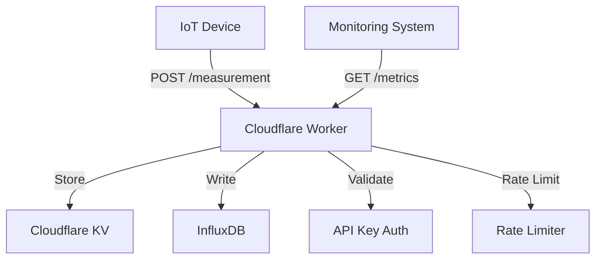

# IoT Backend Service

A serverless IoT backend service built with Cloudflare Workers. This service provides endpoints for device measurements and system metrics, with built-in API key authentication and rate limiting.

## Features

- 🔐 API Key Authentication
- 📊 Device Measurements Collection
- 📈 System Health Metrics
- ⚡ Rate Limiting
- 🔄 Automatic Version Updates
- 📝 Comprehensive Logging
- 🧪 End-to-End Testing

## Architecture



## API Endpoints

### POST /measurement

Submit device measurements.

```bash
curl -X POST https://api.example.com/measurement \
  -H "Content-Type: application/json" \
  -H "x-api-key: your_api_key" \
  -d '{
    "device": {
      "id": "device-123",
      "type": "sensor"
    },
    "readings": {
      "temperature": 25.5,
      "humidity": 60
    }
  }'
```

### GET /metrics

Retrieve system metrics.

```bash
curl https://api.example.com/metrics \
  -H "x-api-key: your_api_key"
```

Response:
```json
{
  "timestamp": "2025-01-05T13:38:19Z",
  "version": "5.3.0",
  "status": {
    "influxdb": "healthy",
    "kv_store": "healthy"
  }
}
```

## Development

### Prerequisites

- Node.js >= 18
- npm >= 9
- Cloudflare account with Workers and KV enabled
- InfluxDB instance

### Setup

1. Clone the repository:
   ```bash
   git clone https://github.com/yourusername/iot-backend.git
   cd iot-backend
   ```

2. Install dependencies:
   ```bash
   npm install
   ```

3. Copy `wrangler.toml.example` to `wrangler.toml` and configure your environment variables:
   ```toml
   [vars]
   INFLUXDB_URL = "your_influxdb_url"
   INFLUXDB_ORG = "your_org"
   INFLUXDB_BUCKET = "your_bucket"
   ```

4. Add your Cloudflare API token secret:
   ```bash
   npx wrangler secret put INFLUXDB_TOKEN
   ```

### Development Commands

- `npm run deploy`: Deploy to Cloudflare Workers
- `npm run test`: Deploy and run end-to-end tests
- `npm run test:watch`: Run tests in watch mode
- `npm run test:coverage`: Generate test coverage report
- `npm run format`: Format code with Prettier
- `npm run lint`: Lint code with ESLint
- `npm run type-check`: Check TypeScript types

### Testing

The project uses end-to-end tests that run against the deployed worker. This ensures we're testing the actual production behavior. Tests are written using Vitest and cover:

- API key validation
- Rate limiting
- Measurement submission
- Metrics retrieval
- Error handling

To run tests:
```bash
npm run test
```

### CI/CD

The project uses GitHub Actions for continuous integration and deployment:

1. On push/PR to main:
   - Deploys to Cloudflare Workers
   - Runs end-to-end tests
   - Uploads coverage reports

2. Version Management:
   - Automatic version bumping based on commit messages
   - Patch: Bug fixes and minor changes
   - Minor: New features
   - Major: Breaking changes

### GitHub Actions Setup

To enable CI/CD with GitHub Actions, you need to add these secrets to your repository:

1. Go to your repository's Settings > Secrets and variables > Actions
2. Add the following secrets:

| Secret Name | Description | How to Get It |
|------------|-------------|---------------|
| `CF_API_TOKEN` | Cloudflare API token | Create at [Cloudflare Dashboard](https://dash.cloudflare.com/profile/api-tokens) using "Edit Cloudflare Workers" template |
| `CF_API_KEYS_ID` | KV namespace ID for API keys | Found in Cloudflare Dashboard > Workers > KV |
| `CF_METRICS_ID` | KV namespace ID for metrics | Found in Cloudflare Dashboard > Workers > KV |
| `INFLUXDB_URL` | Your InfluxDB URL | From your InfluxDB setup |
| `INFLUXDB_ORG` | Your InfluxDB organization | From your InfluxDB setup |
| `INFLUXDB_BUCKET` | Your InfluxDB bucket | From your InfluxDB setup |

Required Cloudflare API Token Permissions:
- Workers Scripts: Edit
- Workers KV Storage: Edit

## License

MIT
