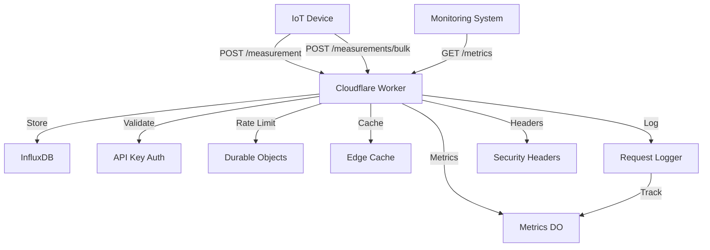

# IoT Backend Service   

A serverless IoT backend service built with Cloudflare Workers. This service provides endpoints for device measurements and system metrics, with built-in API key authentication, rate limiting via Durable Objects, and intelligent caching.

## Table of Contents
- [Features](#features)
- [Architecture](#architecture)
- [Security](#security)
- [API Documentation](#api-documentation)
- [Development](#development)
- [Monitoring](#monitoring)
- [Contributing](#contributing)
- [License](#license)

## Features

- 🔐 **Enhanced Security**
  - API Key Authentication
  - Content Security Policy (CSP)
  - HTTP Security Headers
  - Rate Limiting with Durable Objects
  
- 📊 **Core Functionality**
  - Single and Bulk Device Measurements
  - System Health Metrics
  - Performance Monitoring with Durable Objects
  - Version Control
  
- ⚡ **Cloudflare Optimizations**
  - Intelligent Edge Caching
  - Durable Objects for State Management
  - HTTP/2 Support
  - Bot Management
  
- 📝 **Observability**
  - Real-time Request Metrics
  - Health Monitoring
  - Request Tracing
  - Error Tracking

## Architecture



## Security

### Headers
- Content Security Policy (CSP)
- X-Content-Type-Options
- X-Frame-Options
- X-XSS-Protection
- Referrer-Policy
- Permissions-Policy

### Authentication
- API key validation (stored in KV)
- Rate limiting per key (Durable Objects)
- Request validation middleware

### Performance
- Intelligent edge caching
- Durable Objects for state management
- Cache-Control directives
- Edge caching configuration

## API Documentation

### Base URL
```
https://api.pasts.dev
```

### Authentication
All endpoints (except `/health`, `/time`) require API key authentication:
```bash
curl -H "x-api-key: YOUR_API_KEY" https://api.pasts.dev/endpoint
```

### Rate Limiting
#### Rate Limited Endpoints (100 req/min)
- `/measurement` - Device measurements
- `/measurements/bulk` - Batch measurements
- `/metrics` - System statistics

#### Public Endpoints (No Limit)
- `/health` - System health (30s cache)
- `/time` - Server time
- `/version` - API version (1h cache)

### Metrics and Monitoring

The service provides real-time metrics through the `/metrics` endpoint:

```bash
curl -H "x-api-key: YOUR_API_KEY" https://api.pasts.dev/metrics
```

Response example:
```json
{
  "/health": {
    "total": 150,
    "success": 148,
    "error": 2
  },
  "/metrics": {
    "total": 75,
    "success": 75,
    "error": 0
  }
}
```

Metrics are:
- Stored in Durable Objects
- Cached for 10 seconds
- Available per endpoint
- Track success/error rates

### Cache Management

The service provides two methods to purge cache:

1. Purge All Cache:
```bash
curl -X POST https://api.pasts.dev/cache/purge \
  -H "X-API-Key: YOUR_API_KEY"
```

2. Purge Specific Endpoint:
```bash
curl -X POST https://api.pasts.dev/cache/purge \
  -H "Content-Type: application/json" \
  -H "X-API-Key: YOUR_API_KEY" \
  -d '{"path": "/health"}'
```

Purgeable endpoints:
- `/version` (1h cache)
- `/health` (30s cache)
- `/metrics` (10s cache)

## Development

### Prerequisites
- Node.js 18+
- Wrangler CLI
- Cloudflare Account

### Setup
1. Clone the repository
2. Install dependencies: `npm install`
3. Copy `.env.example` to `.env` and configure
4. Deploy: `wrangler deploy`

### Environment Variables
Required in Cloudflare:
- `INFLUXDB_TOKEN`
- `INFLUXDB_URL`
- `INFLUXDB_ORG`
- `INFLUXDB_BUCKET`

## Contributing
1. Fork the repository
2. Create feature branch
3. Commit changes
4. Create Pull Request

## License
MIT License - see LICENSE file for details
