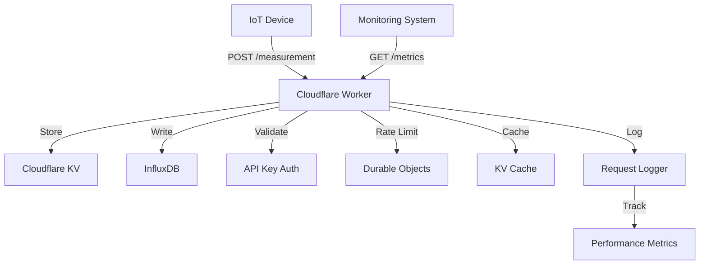

# IoT Backend Service

A serverless IoT backend service built with Cloudflare Workers. This service provides endpoints for device measurements and system metrics, with built-in API key authentication, rate limiting via Durable Objects, and intelligent caching.

## Features

- 🔐 API Key Authentication
- 📊 Device Measurements Collection
- 📈 System Health Metrics
- ⚡ Durable Objects Rate Limiting
- 🔄 Automatic Version Updates
- 📝 Comprehensive Request Logging
- 🧪 End-to-End Testing
- 🚀 Generic KV Caching
- 🔍 Performance Monitoring
- 📋 Request Tracing

## Architecture



## Request Logging

The service implements comprehensive request logging for monitoring and debugging:

### Log Data Captured
- Request ID (for tracing)
- HTTP method and endpoint
- Client information (IP, user agent)
- Request duration
- Response status code
- Cache status
- Rate limit status
- Error details (if any)

### Log Levels
- `INFO`: Successful requests
- `WARN`: Authentication/validation failures
- `ERROR`: System errors and exceptions

### Response Headers
All responses include:
- `x-request-id`: Unique request identifier
- `x-ratelimit-*`: Rate limiting information
- `Cache-Control`: Caching directives
- `Content-Type`: Response format

### Sample Log Output
```json
{
  "timestamp": "2025-01-05T19:02:17Z",
  "level": "info",
  "message": "Request completed",
  "requestId": "f1004c09-7f9b-4906-ac4f-16800eed7757",
  "method": "GET",
  "endpoint": "/metrics",
  "status": 200,
  "duration_ms": 163,
  "clientIp": "192.0.2.1",
  "userAgent": "curl/7.88.1",
  "cacheStatus": "MISS"
}
```

## API Endpoints

### POST /measurement

Submit device measurements.

```bash
curl -X POST https://simple-backend.veilands.workers.dev/measurement \
  -H "Content-Type: application/json" \
  -H "x-api-key: my_api_key_12345" \
  -d '{
    "device": {
      "id": "device-123",
      "type": "sensor"
    },
    "readings": {
      "temperature": 25.5,
      "humidity": 60
    }
  }'
```

### GET /metrics

Retrieve system metrics.

```bash
curl https://simple-backend.veilands.workers.dev/metrics \
  -H "x-api-key: my_api_key_12345"
```

Response:
```json
{
  "timestamp": "2025-01-05T19:02:17Z",
  "version": "5.4.4",
  "status": {
    "influxdb": {
      "status": "healthy",
      "latency": 162
    },
    "kv_store": {
      "status": "healthy",
      "latency": 200
    }
  }
}
```

### GET /health

Get system health status. This endpoint is cached for 30 seconds.

```bash
curl https://simple-backend.veilands.workers.dev/health
```

Response:
```json
{
  "status": "healthy",
  "version": "5.4.4",
  "timestamp": "2025-01-05T19:02:17Z"
}
```

### GET /version

Get the current API version. This endpoint is cached for 1 hour.

```bash
curl https://simple-backend.veilands.workers.dev/version \
  -H "x-api-key: my_api_key_12345"
```

Response:
```text
5.4.4
```

### GET /time

Get the current server time. This endpoint is not cached.

```bash
curl https://simple-backend.veilands.workers.dev/time \
  -H "x-api-key: my_api_key_12345"
```

Response:
```text
9:02:17 PM
```

## Error Handling

The API uses standard HTTP status codes and returns consistent error responses:

### Error Response Format
```json
{
  "error": "Error Type",
  "message": "Human readable error message",
  "requestId": "unique-request-id",
  "timestamp": "2025-01-05T19:02:17Z"
}
```

### Common Error Codes
- `401 Unauthorized`: Missing or invalid API key
- `429 Too Many Requests`: Rate limit exceeded
- `400 Bad Request`: Invalid request format
- `404 Not Found`: Endpoint doesn't exist
- `500 Internal Server Error`: Server-side error

### Error Logging
All errors are automatically logged with:
- Full error stack trace
- Request context (method, endpoint, headers)
- Client information
- Request ID for correlation

### Rate Limit Errors
When rate limit is exceeded, response includes:
```json
{
  "error": "Rate limit exceeded",
  "message": "Too many requests",
  "requestId": "67e228dd-e045-4e69-b2f0-526637c56b37",
  "timestamp": "2025-01-05T19:02:17Z"
}
```
Headers:
```
x-ratelimit-limit: 100
x-ratelimit-remaining: 0
x-ratelimit-reset: 1736103737
```

## Caching

The service implements generic KV caching to improve performance and reduce load:

- `/health` endpoint: Cached for 30 seconds
- `/version` endpoint: Cached for 1 hour
- `/metrics` endpoint: Not cached (real-time data)
- `/time` endpoint: Not cached (real-time data)
- `/measurement` endpoint: Not cached (write operation)

Cache headers in responses:
- `Cache-Control`: Indicates caching duration with `max-age`
- `X-Cache`: Shows cache status (`HIT` or `MISS`)

To bypass cache:
```bash
curl https://simple-backend.veilands.workers.dev/health \
  -H "Cache-Control: no-cache"
```

## Development

### Prerequisites

- Node.js >= 18
- npm >= 9
- Cloudflare account with Workers, KV, and Durable Objects enabled
- InfluxDB instance

### Setup

1. Clone the repository:
   ```bash
   git clone https://github.com/veilands/cf-learn.git
   cd cf-learn
   ```

2. Install dependencies:
   ```bash
   npm install
   ```

3. Configure environment:
   ```bash
   # Copy example configuration
   cp wrangler.toml.example wrangler.toml

   # Add your Cloudflare API token secret
   npx wrangler secret put INFLUXDB_TOKEN
   ```

### Development Commands

- `npm run deploy`: Deploy to Cloudflare Workers
- `npm run test`: Run tests with Vitest
- `npm run test:coverage`: Generate test coverage report
- `npm run format`: Format code with Prettier
- `npm run lint`: Lint code with ESLint
- `npm run type-check`: Check TypeScript types

### Testing

The project includes comprehensive tests using Vitest:

#### Test Coverage
- API endpoints
- Authentication
- Rate limiting with Durable Objects
- Generic KV caching
- Error handling
- Request validation

#### Running Tests
```bash
# Run all tests
npm run test

# Run with coverage report
npm run test:coverage

# Run specific test file
npm run test src/tests/rateLimiter.test.ts
```

#### Shell Script Testing
For quick API testing:
```bash
# Test all endpoints
./test-endpoints.sh

# Test rate limiting
./test-rate-limit.sh
```

### Monitoring and Debugging

#### Request Tracing
Every request can be traced using the `x-request-id` header:

1. Find request ID in response headers
2. Search logs using the request ID
3. View complete request lifecycle

#### Performance Monitoring
Monitor API performance using:
- Request duration metrics
- Cache hit rates
- Error rates
- Rate limit usage

#### Log Levels
Configure log level in `wrangler.toml`:
```toml
[vars]
LOG_LEVEL = "debug" # Options: debug, info, warn, error
```

### Deployment

1. Build and deploy:
   ```bash
   npm run deploy
   ```

2. Verify deployment:
   ```bash
   curl https://simple-backend.veilands.workers.dev/health
   ```

3. Monitor logs in Cloudflare Dashboard

## License

MIT
