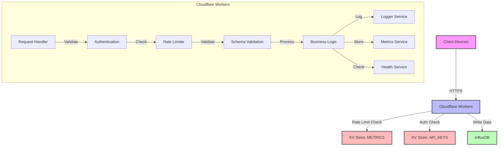
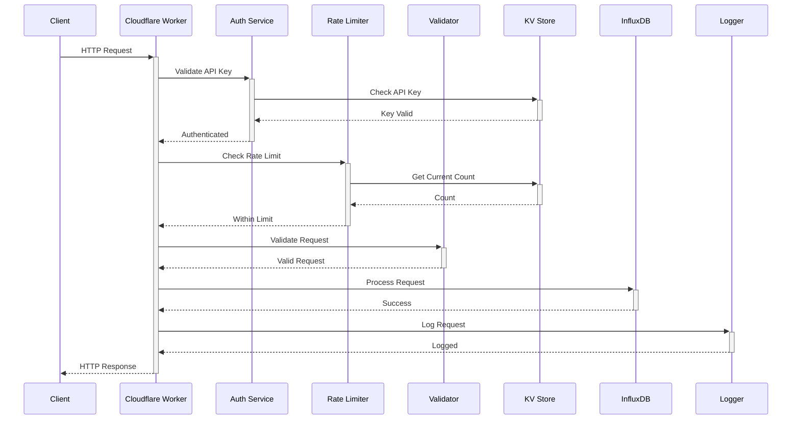
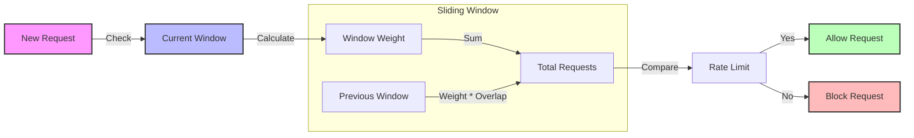
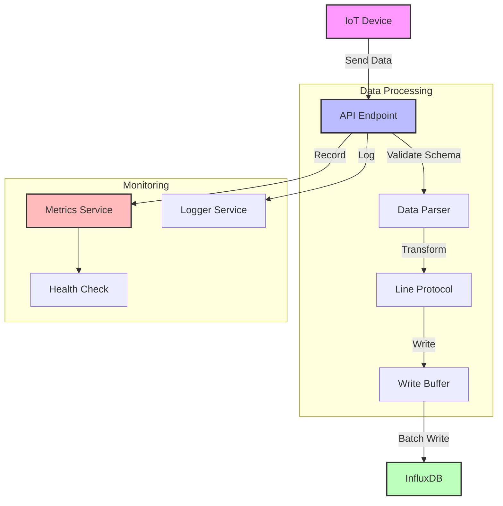
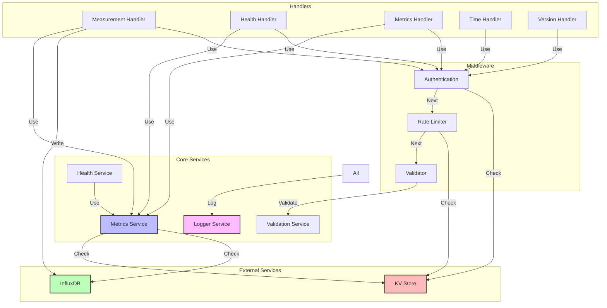
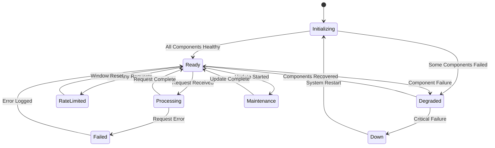

# System Architecture

## High-Level Architecture



## Request Flow



## Rate Limiting Design



## Data Flow



## Component Interactions



## System States



## Validation Flow

```mermaid
graph TD
    Request[Request] -->|Extract| Data[Request Data]
    Data -->|Parse| JSON[JSON Data]
    JSON -->|Validate| Schema[Schema Validation]
    
    subgraph Schema Validation
        Required[Check Required Fields]
        Types[Validate Types]
        Ranges[Check Ranges]
        Extra[Check Extra Fields]
    end
    
    Schema -->|Valid| Process[Process Request]
    Schema -->|Invalid| Error[Return Error]
    
    style Request fill:#f9f,stroke:#333,stroke-width:2px
    style Schema fill:#bbf,stroke:#333,stroke-width:2px
    style Process fill:#bfb,stroke:#333,stroke-width:2px
    style Error fill:#fbb,stroke:#333,stroke-width:2px
