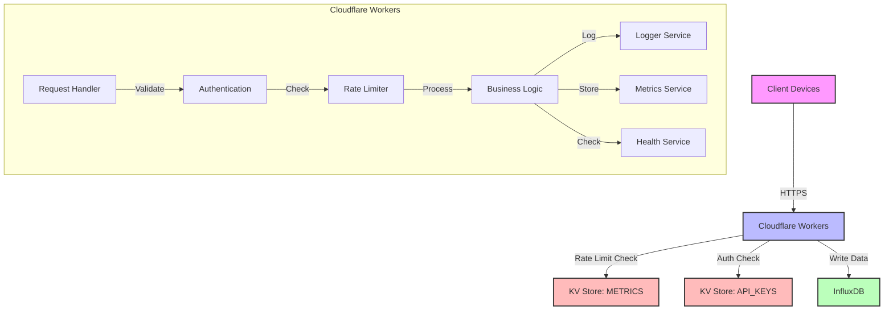
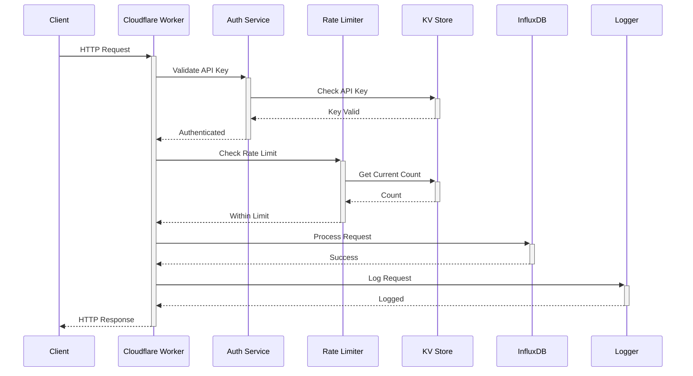
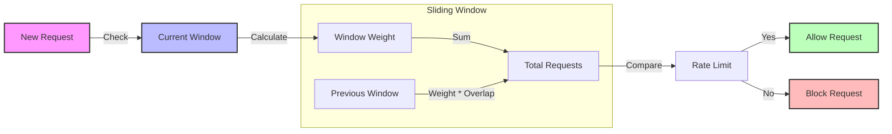
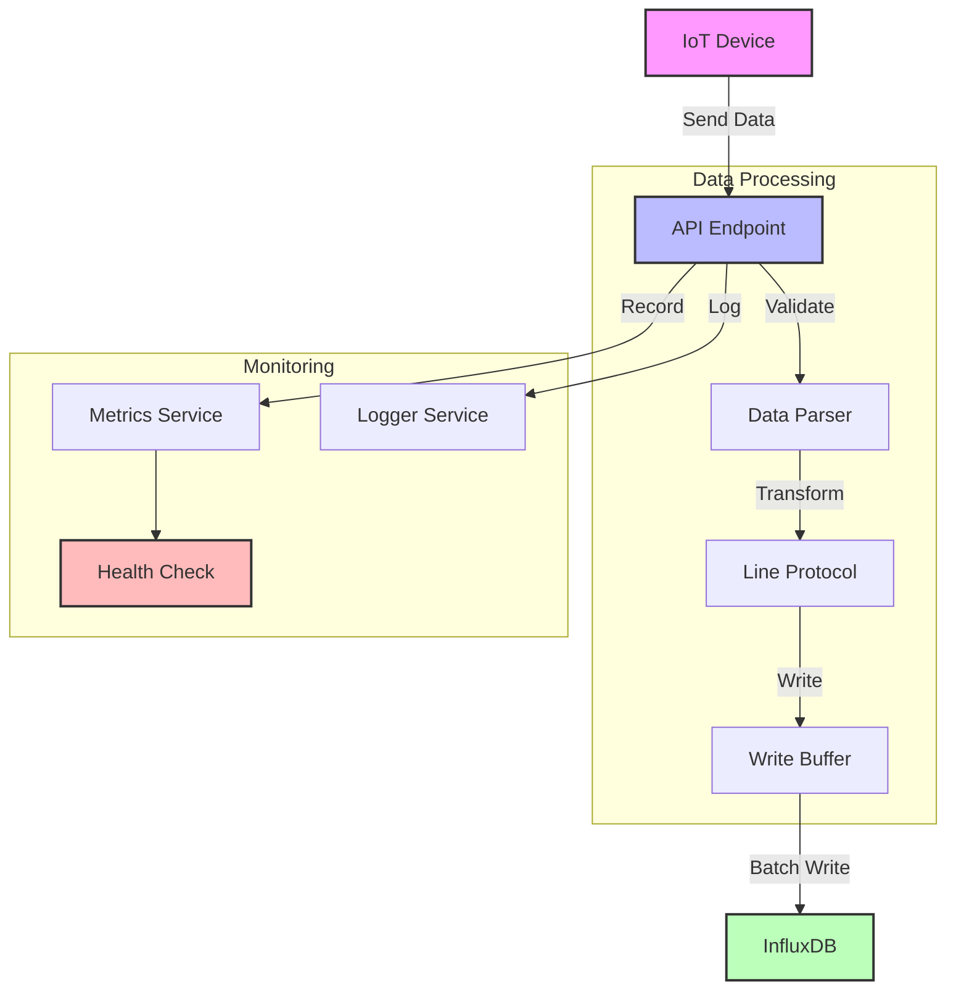
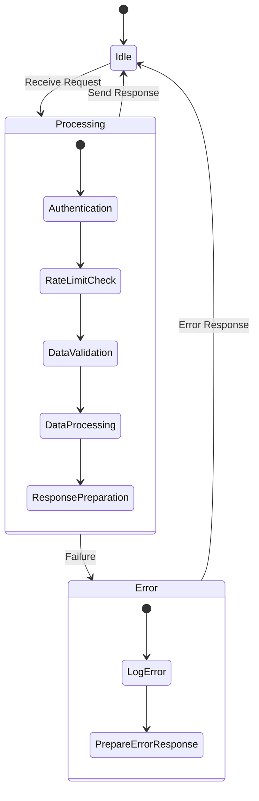

# System Architecture

## High-Level Architecture



## Request Flow



## Rate Limiting Design



## Data Flow



## Component Interaction

```mermaid
graph TD
    subgraph External Services
        IDB[InfluxDB]
        KV[KV Store]
    end
    
    subgraph Core Services
        Health[Health Service]
        Metrics[Metrics Service]
        Logger[Logger Service]
        RateLimit[Rate Limiter]
    end
    
    subgraph Request Handling
        Router[Request Router]
        Auth[Authentication]
        Validation[Request Validation]
        Handler[Request Handler]
    end
    
    Router -->|Route| Handler
    Handler -->|Check| Auth
    Handler -->|Validate| Validation
    Handler -->|Check| RateLimit
    Handler -->|Use| Core Services
    Core Services -->|Use| External Services

    style External Services fill:#f9f,stroke:#333,stroke-width:4px
    style Core Services fill:#bbf,stroke:#333,stroke-width:4px
    style Request Handling fill:#bfb,stroke:#333,stroke-width:4px
```

## System States


