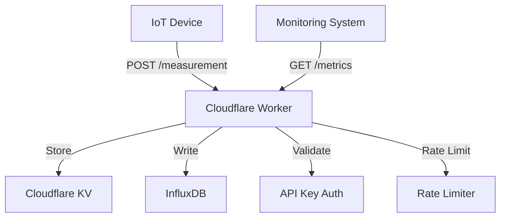
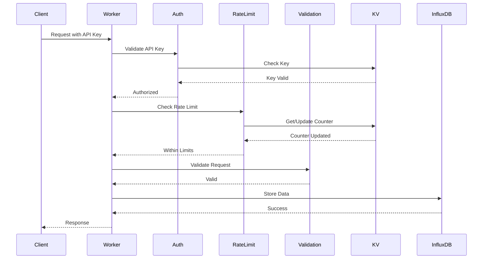
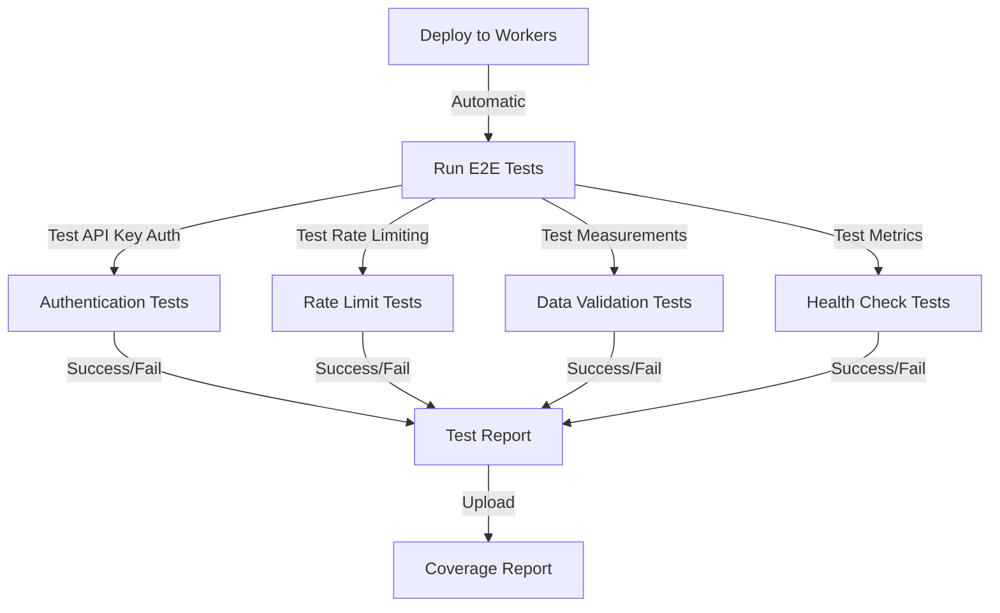
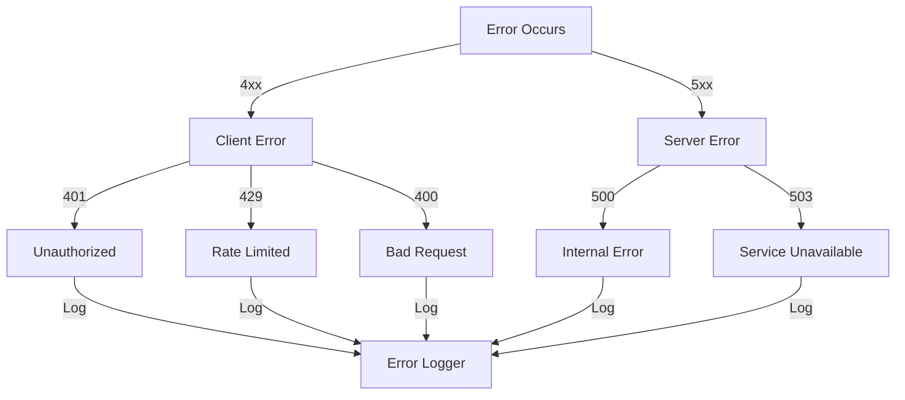
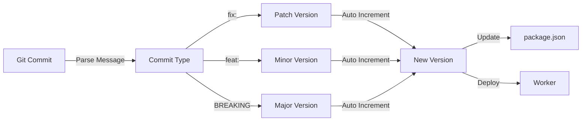

# Architecture Documentation

## System Overview

## Request Flow

## Component Interactions

### API Key Authentication
- Stored in Cloudflare KV
- Validated on every request
- Rate limits tracked per key

### Rate Limiting
- Sliding window implementation
- 100 requests per minute per API key
- Counter stored in KV
- Headers included in response

### Validation
- Schema-based validation using Zod
- Required fields enforced
- Type checking
- Range validation for numeric values

### Data Storage
- Measurements stored in InfluxDB
- Metrics stored in KV
- Health status cached in KV

## Testing Strategy

### End-to-End Testing
1. Deploy worker to production environment
2. Run tests against live worker
3. Verify:
   - API key validation
   - Rate limiting
   - Data validation
   - Metrics collection
   - Error handling

### CI/CD Pipeline
1. On push to main:
   - Deploy to Cloudflare Workers
   - Run E2E tests
   - Generate coverage report
   - Upload results to Codecov

## Error Handling

### Error Types
- 400: Bad Request (Invalid data)
- 401: Unauthorized (Invalid API key)
- 429: Too Many Requests (Rate limit exceeded)
- 500: Internal Server Error
- 503: Service Unavailable (InfluxDB down)

## Version Management

### Version Rules
- Patch (0.0.x): Bug fixes and minor changes
- Minor (0.x.0): New features
- Major (x.0.0): Breaking changes
