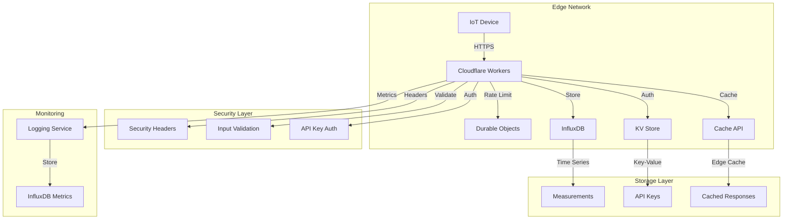
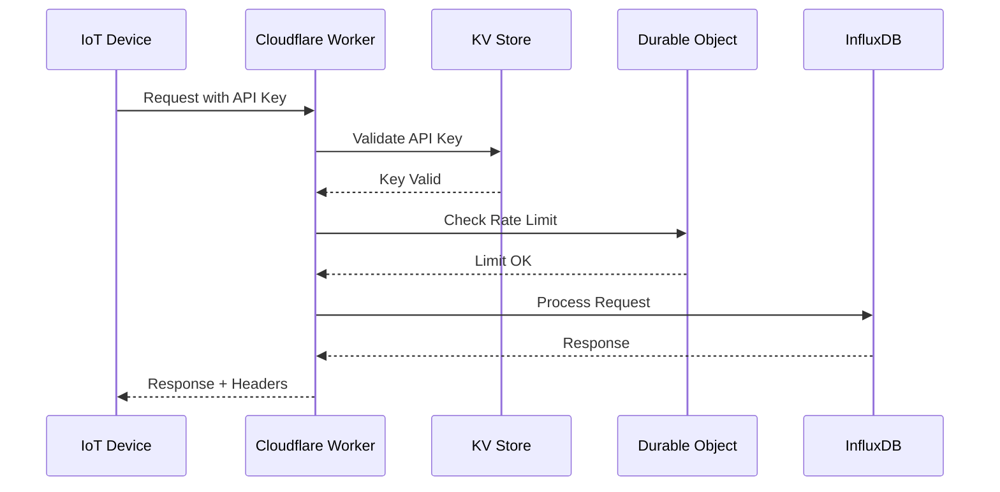
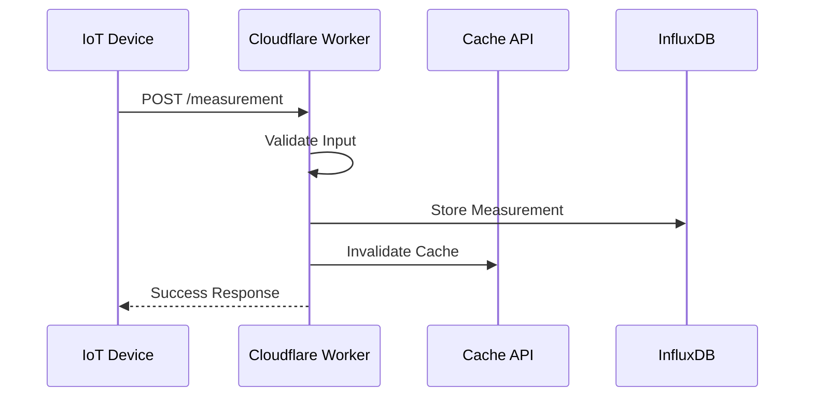
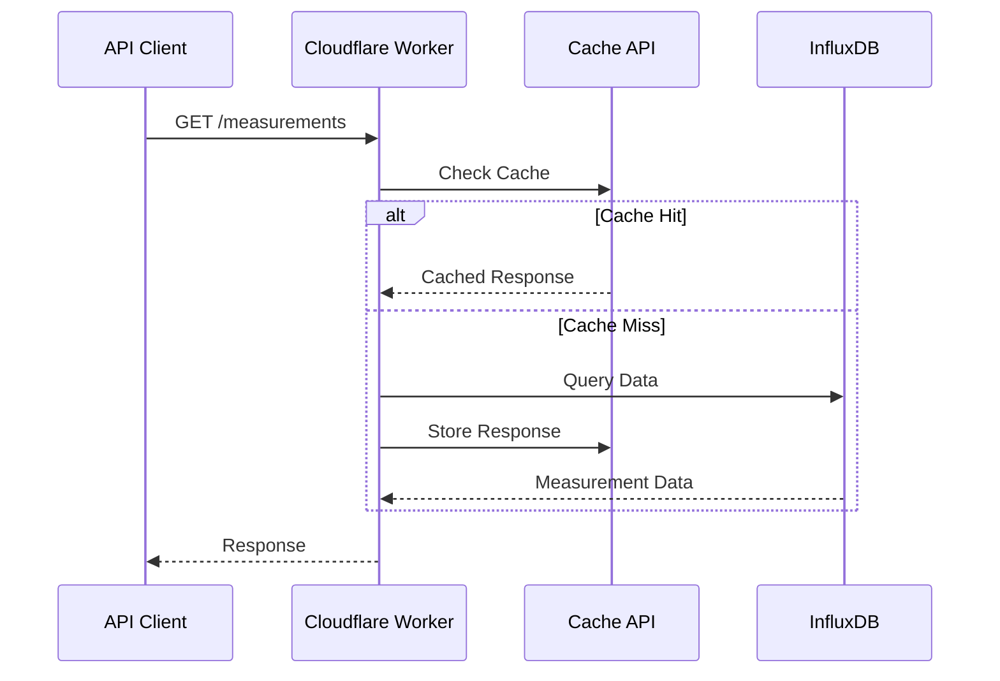

# IoT Backend Architecture

## System Overview

This document describes the architecture of our IoT backend system built on Cloudflare Workers. The system provides a scalable, secure, and performant API for IoT devices to store and retrieve measurements.



## Core Components

### 1. Request Processing Layer

#### API Gateway (Cloudflare Workers)
- Handles all incoming HTTP requests
- Routes requests to appropriate handlers
- Implements middleware chain
- Manages response lifecycle
- Handles CORS and preflight requests

#### Middleware Chain
1. **Security Headers**
   - Sets CSP and security headers
   - Implements CORS policies
   - Manages response headers

2. **Authentication**
   - Validates API keys from KV store
   - Implements rate limiting
   - Manages authorization logic

3. **Input Validation**
   - Validates request parameters
   - Sanitizes input data
   - Enforces schema validation

4. **Rate Limiting**
   - Uses Durable Objects for distributed rate limiting
   - Implements sliding window algorithm
   - Manages rate limit tiers
   - Adds rate limit headers

5. **Caching**
   - Implements Cache API integration
   - Manages cache lifecycle
   - Handles cache invalidation
   - Sets cache headers

### 2. Storage Layer

#### InfluxDB Integration
- Stores time-series measurements
- Implements data retention policies
- Manages bucket organization
- Handles batch operations

#### KV Store
- Stores API keys and metadata
- Manages configuration data
- Implements cache for static data
- Handles key rotation

#### Cache API
- Caches frequent requests
- Implements cache warming
- Manages cache invalidation
- Optimizes response times

### 3. Security Implementation

#### Authentication


#### Security Features
- API key authentication
- Rate limiting with Durable Objects
- Input validation and sanitization
- Security headers implementation
- CORS policy enforcement
- TLS 1.3 enforcement

### 4. Monitoring and Logging

#### Logging Implementation
- Structured logging format
- Cloudflare-specific fields
- Performance metrics
- Error tracking
- Security events

#### Metrics Collection
- Request duration
- Cache hit rates
- Rate limit usage
- Error rates
- Geographic distribution

## API Endpoints

### Measurements API
```typescript
interface MeasurementEndpoints {
  'POST /measurement': {
    body: Measurement;
    response: MeasurementResponse;
  };
  'GET /measurements': {
    query: MeasurementQuery;
    response: MeasurementList;
  };
}
```

### System API
```typescript
interface SystemEndpoints {
  'GET /version': {
    response: VersionInfo;
  };
  'GET /health': {
    response: HealthStatus;
  };
  'POST /cache/purge': {
    body: PurgeRequest;
    response: PurgeResponse;
  };
}
```

## Data Flow

### Measurement Storage Flow


### Measurement Retrieval Flow


## Performance Optimizations

### Edge Computing
- Global distribution via Cloudflare's network
- Reduced latency through edge processing
- Automatic load balancing
- DDoS protection

### Caching Strategy
- Edge caching for static responses
- Cache warming for frequent requests
- Intelligent cache invalidation
- Cache-Control header optimization

### Rate Limiting
- Distributed rate limiting
- Sliding window algorithm
- Multiple rate limit tiers
- Graceful degradation

## Deployment Architecture

### Development Workflow


### Environment Management
- Production environment
- Staging environment
- Development environment
- Secrets management

## Error Handling

### Error Response Structure
```typescript
interface ErrorResponse {
  error: string;
  message: string;
  errorId: string;
  details?: Record<string, unknown>;
  timestamp: string;
}
```

### Error Categories
1. **Client Errors (4xx)**
   - Invalid input
   - Authentication failures
   - Rate limit exceeded
   - Invalid requests

2. **Server Errors (5xx)**
   - Database errors
   - Worker runtime errors
   - Third-party service failures
   - Resource exhaustion

## Future Enhancements

### Planned Features
1. **Enhanced Analytics**
   - Real-time dashboards
   - Custom metrics
   - Anomaly detection
   - Usage analytics

2. **Security Enhancements**
   - Advanced rate limiting
   - Fraud detection
   - Automated blocking
   - Security analytics

3. **Performance Optimization**
   - Smart caching
   - Predictive scaling
   - Request coalescing
   - Edge computing optimization

## Best Practices

### Development
1. Use TypeScript for type safety
2. Implement comprehensive testing
3. Follow clean code principles
4. Document all components
5. Use semantic versioning

### Security
1. Implement defense in depth
2. Follow least privilege principle
3. Regular security audits
4. Automated security testing
5. Incident response plan

### Operations
1. Monitoring and alerting
2. Performance tracking
3. Capacity planning
4. Disaster recovery
5. Documentation maintenance
