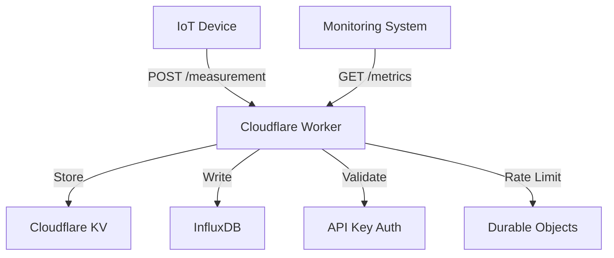
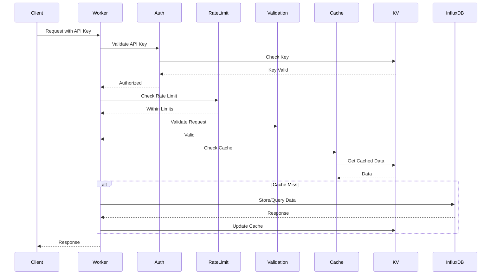
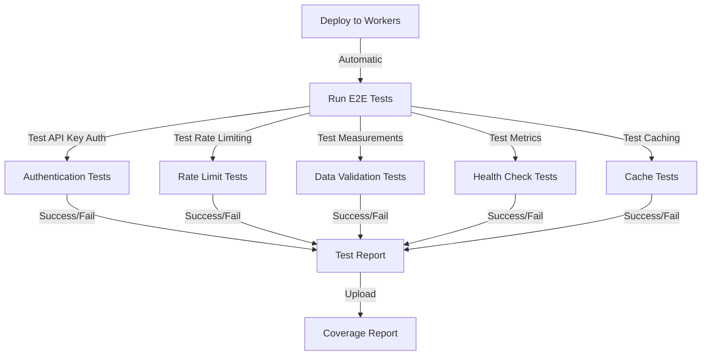

# Architecture Documentation

## System Overview



## Request Flow



## Component Interactions

### API Key Authentication
- Stored in Cloudflare KV
- Validated on every request
- Rate limits tracked per key
- Middleware-based validation

### Rate Limiting
- Durable Objects implementation
- 100 requests per minute per API key
- Globally consistent across all edge locations
- Headers included in response

### Validation
- Middleware-based validation
- Schema-based validation using Zod
- Required fields enforced
- Type checking
- Range validation for numeric values

### Caching
- Generic KV caching functions
- Cache middleware for common operations
- Configurable TTL per endpoint
- Automatic cache invalidation

### Data Storage
- Measurements stored in InfluxDB
- Metrics stored in KV
- Health status cached in KV
- Rate limit state in Durable Objects

## Testing Strategy



### End-to-End Testing
1. Deploy worker to production environment
2. Run tests against live worker
3. Verify:
   - API key validation
   - Rate limiting
   - Data validation
   - Metrics collection
   - Caching behavior
   - Error handling

### CI/CD Pipeline
1. On push to main:
   - Run unit tests
   - Deploy to Cloudflare Workers
   - Run E2E tests
   - Generate coverage report
   - Upload results to Codecov

## Error Handling

### Error Categories
1. Authentication Errors (401)
2. Rate Limit Errors (429)
3. Validation Errors (400)
4. Internal Server Errors (500)

### Error Response Format
```json
{
  "error": "Error type",
  "message": "Detailed error message",
  "requestId": "Unique request identifier",
  "timestamp": "2025-01-05T21:00:42+02:00"
}
```
