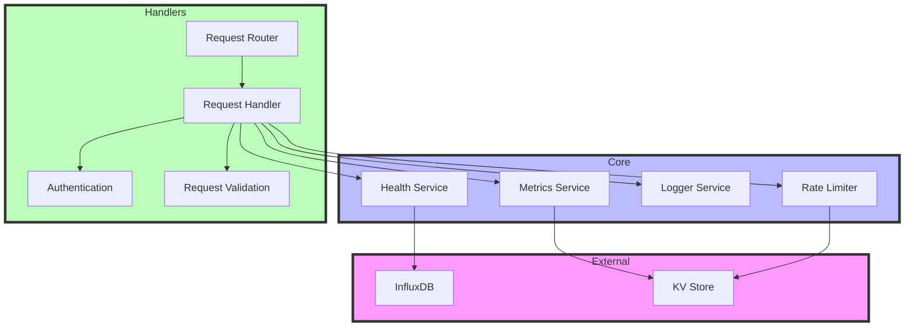

# System Architecture

## High-Level Architecture


## Request Flow


## Rate Limiting Design


## Data Flow


## Component Interaction



## System States

```mermaid
stateDiagram-v2
    [*] --> Idle
    Idle --> Processing: Receive Request
    
    state Processing {
        [*] --> Authentication
        Authentication --> RateLimitCheck
        RateLimitCheck --> DataValidation
        DataValidation --> DataProcessing
        DataProcessing --> ResponsePreparation
    }
    
    Processing --> Idle: Send Response
    Processing --> Error: Failure
    Error --> Idle: Error Response
    
    state Error {
        [*] --> LogError
        LogError --> PrepareErrorResponse
    }
