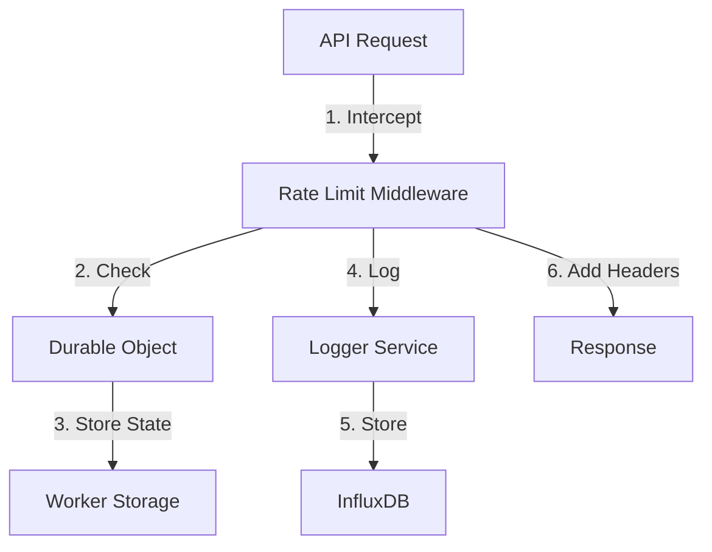

# Rate Limiting Architecture

## Overview

Our API implements a distributed rate limiting system using Cloudflare Durable Objects, providing globally consistent rate limiting across all edge locations. This ensures fair API usage and protects our infrastructure from abuse.

## System Architecture



## Components

### 1. Rate Limit Middleware (`src/middleware/rateLimit.ts`)
- Intercepts all API requests
- Manages rate limit state via Durable Objects
- Adds rate limit headers to responses
- Integrates with logging system
- Handles error cases gracefully
- Implements retry-after logic

### 2. Rate Limiter Durable Object (`src/durable_objects/rateLimiter.ts`)
- Maintains distributed rate limit state
- Provides atomic counter operations
- Implements sliding window rate limiting
- Handles auto-cleanup of expired data
- Ensures thread-safe operations
- Supports multiple rate limit tiers

## Rate Limit Configuration

### Default Settings
```typescript
{
  limit: 100,           // requests per window
  windowSeconds: 60,    // window size in seconds
  tier: 'standard'      // rate limit tier
}
```

### Rate Limit Tiers
```typescript
{
  standard: {
    limit: 100,
    windowSeconds: 60
  },
  premium: {
    limit: 1000,
    windowSeconds: 60
  },
  unlimited: {
    limit: Infinity,
    windowSeconds: 60
  }
}
```

## Response Headers

All API responses include the following rate limit headers:

| Header | Description |
|--------|-------------|
| `X-RateLimit-Limit` | Maximum requests allowed in the window |
| `X-RateLimit-Remaining` | Remaining requests in current window |
| `X-RateLimit-Reset` | Unix timestamp when the limit resets |
| `X-RateLimit-Tier` | Current rate limit tier |
| `Retry-After` | Seconds to wait when rate limited |

## Error Responses

### Rate Limit Exceeded (429)
```json
{
  "error": "Too Many Requests",
  "message": "Rate limit exceeded. Please try again later.",
  "errorId": "67e228dd-e045-4e69-b2f0-526637c56b37",
  "details": {
    "limit": 100,
    "remaining": 0,
    "reset": 1736103737,
    "tier": "standard",
    "retryAfter": 30
  }
}
```

### Headers for Rate Limited Response
```http
HTTP/1.1 429 Too Many Requests
Content-Type: application/json
X-RateLimit-Limit: 100
X-RateLimit-Remaining: 0
X-RateLimit-Reset: 1736103737
X-RateLimit-Tier: standard
Retry-After: 30
```

## Monitoring and Metrics

### InfluxDB Metrics
Rate limit metrics are stored with the following fields:

- `rate_limit_remaining`: Remaining requests
- `rate_limit_used`: Used requests
- `rate_limit_total`: Total limit
- `rate_limit_usage_percent`: Usage percentage

Tags:
- `endpoint`: API endpoint
- `api_key`: Hashed API key identifier
- `tier`: Rate limit tier
- `status`: Request status

### Example InfluxDB Queries

#### High Usage Detection
```sql
SELECT mean("rate_limit_usage_percent") 
FROM "api_metrics" 
WHERE time > now() - 1h 
GROUP BY "api_key", "tier", time(5m) 
HAVING mean("rate_limit_usage_percent") > 80
```

#### Rate Limit Violations
```sql
SELECT count("status") 
FROM "api_metrics" 
WHERE "status" = 429 
GROUP BY "api_key", "tier", time(1h)
```

## Edge Cases and Error Handling

1. **Durable Object Unavailable**
```json
{
  "error": "Internal Server Error",
  "message": "Rate limiter temporarily unavailable",
  "errorId": "89e228dd-e045-4e69-b2f0-526637c56b39",
  "retryAfter": 5
}
```

2. **Invalid API Key**
```json
{
  "error": "Unauthorized",
  "message": "Invalid API key",
  "errorId": "90e228dd-e045-4e69-b2f0-526637c56b40"
}
```

## Best Practices

### Rate Limit Implementation
1. Use sliding windows for accurate rate limiting
2. Implement graceful degradation
3. Provide clear error messages
4. Include retry-after headers
5. Log rate limit events

### Client Integration
1. Respect rate limit headers
2. Implement exponential backoff
3. Cache rate limit state
4. Monitor usage patterns
5. Handle rate limit errors gracefully

### Security Considerations
1. Rate limit by API key
2. Implement IP-based fallback
3. Use secure key storage
4. Monitor for abuse patterns
5. Implement graduated response

## Cloudflare-Specific Features

### Edge Rate Limiting
- Distributed rate limiting at edge locations
- Consistent rate limiting across regions
- Low-latency rate limit checks
- Automatic failover handling

### Durable Objects Benefits
- Globally consistent state
- Atomic operations
- High availability
- Real-time rate limit updates
- Cross-region synchronization

### Performance Optimization
- Rate limit checks at edge
- Minimal latency impact
- Efficient state management
- Optimized storage access

## Future Improvements

1. **Enhanced Rate Limiting**
   - Dynamic rate limits based on usage patterns
   - Machine learning-based abuse detection
   - Custom rate limit rules per endpoint

2. **Monitoring Enhancements**
   - Real-time rate limit dashboards
   - Automated alerting system
   - Usage trend analysis

3. **Client Tools**
   - Rate limit prediction
   - Usage optimization suggestions
   - Automatic retry handling
