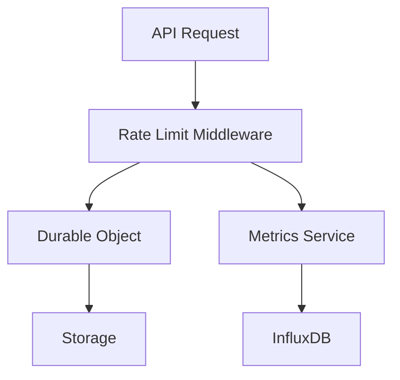

# Rate Limiting Architecture

## Overview

Our API implements a distributed rate limiting system using Cloudflare Durable Objects. This provides globally consistent rate limiting across all edge locations.



## Components

### 1. Rate Limit Middleware (`src/middleware/rateLimit.ts`)
- Handles HTTP request/response lifecycle
- Adds rate limit headers to responses
- Integrates with metrics system
- Error handling and logging
- Communicates with Durable Objects

### 2. Rate Limiter Durable Object (`src/durable_objects/rateLimiter.ts`)
- Maintains rate limit state
- Provides atomic counter operations
- Handles window-based rate limiting
- Auto-cleanup of expired data
- Thread-safe operations

## Rate Limit Configuration

Default configuration:
```typescript
{
  limit: 100,          // requests per window
  windowSeconds: 60    // window size in seconds
}
```

## Headers

The API includes the following rate limit headers in all responses:

| Header | Description |
|--------|-------------|
| `X-RateLimit-Limit` | Maximum requests allowed in the window |
| `X-RateLimit-Remaining` | Remaining requests in current window |
| `X-RateLimit-Reset` | Unix timestamp when the limit resets |

## Metrics

Rate limit metrics are stored in InfluxDB with the following fields:

- `rate_limit_remaining`: Remaining requests
- `rate_limit_used`: Used requests
- `rate_limit_total`: Total limit
- `rate_limit_usage_percent`: Usage percentage

Tags:
- `endpoint`: API endpoint
- `api_key`: Hashed API key identifier

## Example InfluxDB Queries

### High Usage Detection
```sql
SELECT mean("rate_limit_usage_percent") 
FROM "api_metrics" 
WHERE time > now() - 1h 
GROUP BY "api_key", time(5m) 
HAVING mean("rate_limit_usage_percent") > 80
```

### Rate Limit Violations
```sql
SELECT count("status") 
FROM "api_metrics" 
WHERE "status" = 429 
GROUP BY "api_key", time(1h)
```

## Error Handling

1. **Rate Limit Exceeded (429)**
   ```json
   {
     "error": "Rate limit exceeded",
     "message": "Too many requests",
     "resetTime": "2025-01-05T21:00:00Z",
     "requestId": "67e228dd-e045-4e69-b2f0-526637c56b37"
   }
   ```

2. **Internal Error (500)**
   ```json
   {
     "error": "Internal server error",
     "message": "Rate limiter unavailable",
     "requestId": "67e228dd-e045-4e69-b2f0-526637c56b37"
   }
   ```

## Testing

Rate limiting can be tested using the provided shell scripts:

1. `test-endpoints.sh`: Tests all endpoints including rate limit headers
2. `test-rate-limit.sh`: Specifically tests rate limiting behavior

Example test command:
```bash
./test-rate-limit.sh
